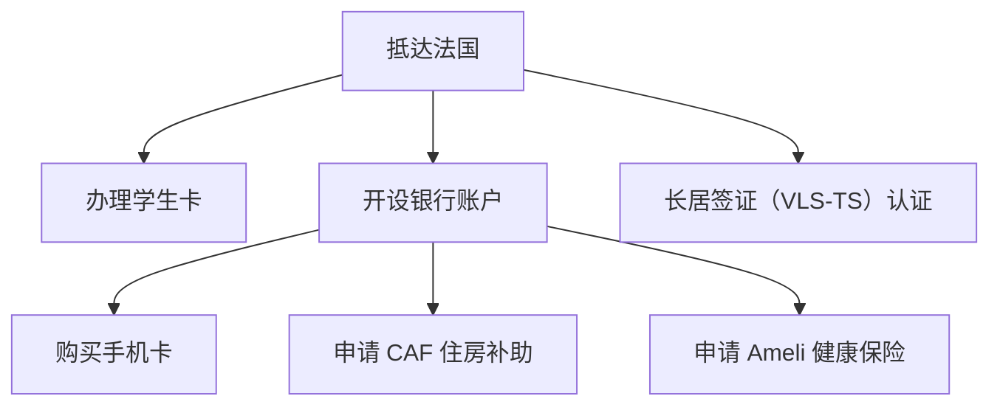
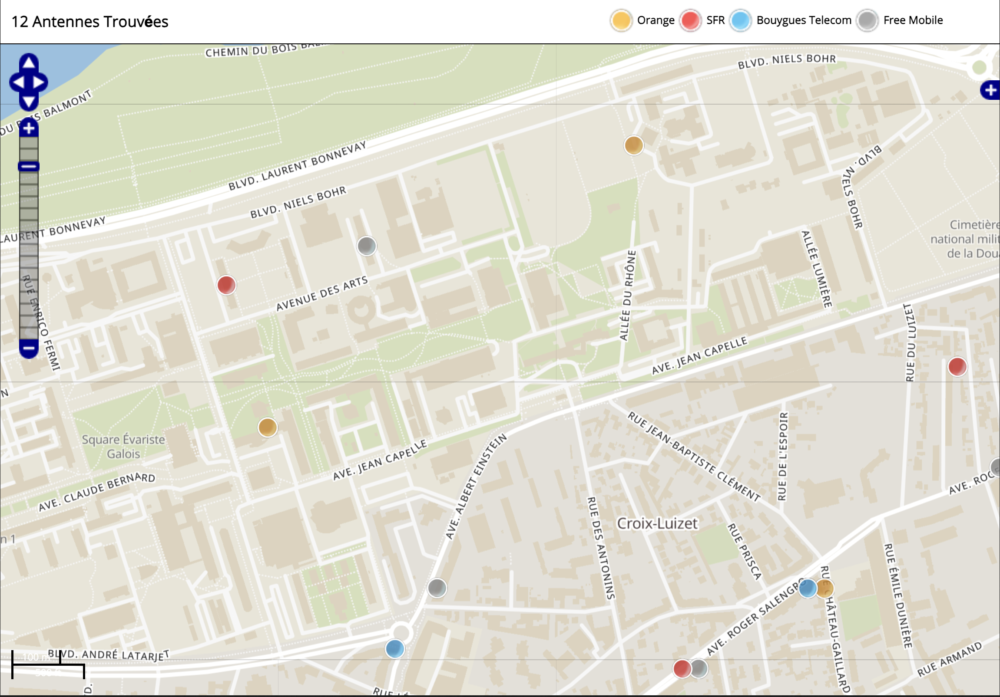

# 必办事项

以下是刚到法国必办事项的依存关系图：

事项可以同时办理，但需要按箭头指向的顺序完成。

## 办理学生卡

待完善

## 开设银行账户

INSA 现在和 Société Générale 银行合作，新生可以直接在学校办理银行账户。工作人员会说英语，法语不好的同学也不用担心。

## 购买手机卡

法国的网络运营商有 Orange、SFR、Bouygues Telecom、Free 等，下图为学校附近的 4G 基站分布，体验以实际情况为准。

套餐主要分无合约（sans engagement）和有合约（avec engagement）的。无合约的套餐可以随时取消，有合约的套餐需要签订一年或两年的合约，如果提前取消需要支付违约金。这里不推荐有合约的套餐，因为其优惠力度不如无合约的套餐，而且违约了会很麻烦。

购买手机卡线上线下都可以。线下的优势是办理速度快（需要预约），线上的优势是优惠力度大，但有些运营商会要求邮寄证件复印件，核实后还需要等待快递送卡。

线下办理建议去 Part-Dieu，需要带身份证件、RIB[^1] 和居住证明。线上可以选择 Sosh（Orange 的子公司）等。

[^1]:
  Relevé d'Identité Bancaire，银行账户信息单。