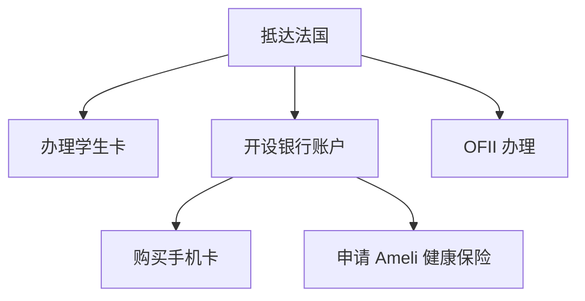

# 必办事项

以下是刚到法国必办事项的依存关系图：

事项可以同时办理，但需要按箭头指向的顺序完成。

## 办理学生卡

每年办理学生卡的情况都不太一样，但一般学校会尽快让你拿到。学生卡可以用于图书馆借书、食堂用餐、打印等。
## 开设银行账户

INSA 现在和 Société Générale 银行合作，新生可以直接在学校办理银行账户。工作人员会说英语，法语不好的同学也不用担心。

## 购买手机卡

法国的网络运营商有 Orange、SFR、Bouygues Telecom、Free 等。
??? info "学校周围 4G 基站分布"
    

套餐主要分无合约（sans engagement）和有合约（avec engagement）的。无合约的套餐可以随时取消，有合约的套餐需要签订一年或两年的合约，如果提前取消需要支付违约金。这里不推荐有合约的套餐，因为其优惠力度不如无合约的套餐，而且违约了会很麻烦。

购买手机卡线上线下都可以。线下的优势是办理速度快（需要预约），线上的优势是优惠力度大，但有些运营商会要求邮寄证件复印件，核实后还需要等待快递送卡。

线下办理建议去 Part Dieu，需要带身份证件、RIB[^1] 和居住证明。线上可以选择 Sosh（Orange 的子公司）等。

## 办理 OFII 认证

需要线上办理认证：<https://administration-etrangers-en-france.interieur.gouv.fr/particuliers/#/vls-ts/demarches/etape/numero-visa>

知乎[这篇文章](https://zhuanlan.zhihu.com/p/394514576)写得很详细，可以跟着教程来。

## 申请医疗保险

Ameli 需要先在线上办理。

线上办理这个部分可以参考[这篇文章](https://zhuanlan.zhihu.com/p/405182370)。

审核通过后，可以下载一份临时的医保证明，用于医院就诊。

如果收到绿色的需返还的信封，说明已收到永久医保号。推荐的做法是：

不要将任何文件邮寄，直接前往 Part Dieu 附近的 CPAM 社保中心（位于 T3 的 PD 站旁边）。
排队于无预约队伍，并说明你需要提交的资料。
当场向工作人员提交护照复印件与 3.5x4.5 照片，并要求获得用于激活 Ameli 账号的临时密码。
登录 Ameli 网站，使用临时密码并更新个人信息和密码。
登录后可以申请 Carte Vitale & CEAM（医保卡和欧洲医疗保险卡）。

## 注意事项

- 激活 Ameli 账号后，再进行 CAF 账号的建立，以防意外。
- 学校邮件系统可能存在问题。如果长时间未收到信件或包裹，建议直接前往 service courrier 学校快递处询问。避免只问单件邮件，因为邮件处的工作人员可能只会给你一件。
- 在拿到正式医保号之前，可以使用临时医保号就诊，记得带上长居 OFII 证明和临时医保证明。

[^1]:
  Relevé d'Identité Bancaire，银行账户信息单。